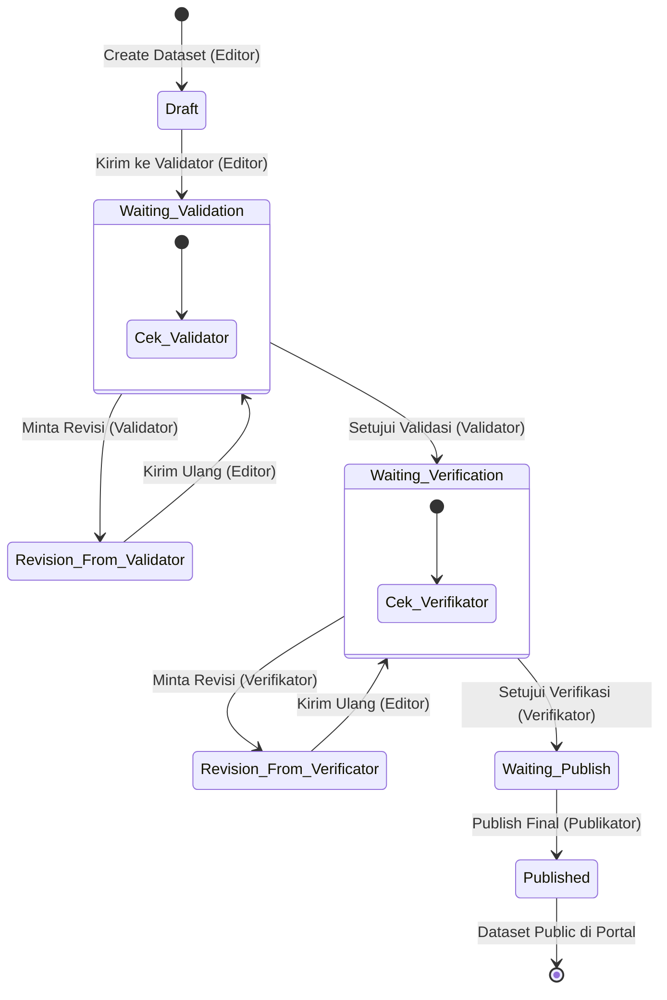

# Business Requirements Document (BRD)
## Sistem Portal Data & Workflow Publikasi Statistik (CKAN)

---

## 1. Pendahuluan

### 1.1 Latar Belakang
Dalam pengelolaan data statistik sektoral daerah, kualitas, validitas, dan keamanan data merupakan hal yang sangat krusial. Sebelum data dipublikasikan ke masyarakat luas, data tersebut harus melalui berbagai tahapan pemeriksaan dan persetujuan oleh pihak-pihak berwenang di tingkat Organisasi Perangkat Daerah (OPD) dan instansi pembina. 

Sistem yang dibangun ini mengintegrasikan **CKAN (Comprehensive Knowledge Archive Network)** sebagai *Data Management System* (DMS) di sisi backend dengan **Portal Frontend kustom** berbasis React untuk penyajian data kepada publik yang interaktif, cepat, dan modern.

### 1.2 Tujuan Proyek
* **Menjamin Validitas Data**: Menerapkan alur persetujuan bertahap dari pembuat data hingga pembuat keputusan sebelum data dirilis ke publik.
* **Meningkatkan Keamanan Data**: Menerapkan kebijakan *Private-by-Default*, di mana semua data yang sedang diproses bersifat rahasia dan hanya menjadi konsumsi publik jika telah disetujui secara final.
* **Mempermudah Akses Publik**: Menyediakan portal publik yang bersih, memiliki performa tinggi, fitur visualisasi grafik otomatis, dan opsi unduh dalam berbagai format file standar.
* **Otomasi Pengolahan Data**: Menyediakan konverter otomatis untuk file tabel HTML berformat `.xls` palsu agar dapat dibaca secara tabular di database DataStore CKAN.

---

## 2. Peran Pengguna (User Roles) & Hak Akses

Sistem membagi pengguna ke dalam beberapa peran dengan tanggung jawab bisnis spesifik:

| Peran (Role) | Deskripsi Bisnis | Hak Akses Utama |
| --- | --- | --- |
| **Editor (OPD)** | Pembuat data statistik dari masing-masing OPD. | Membuat dataset baru, mengunggah file data, mengedit konten dataset, dan mengirimkan dataset ke tahap Validasi. |
| **Validator** | Pemeriksa data dari sisi kesesuaian teknis dan standar data awal. | Melakukan review teknis, menyetujui validasi data (mengirim ke Verifikator), atau menolak data (mengembalikan ke Editor dengan catatan revisi). |
| **Verifikator** | Pemeriksa data dari sisi substansi dan kebijakan instansi. | Melakukan verifikasi substansi, menyetujui verifikasi data (mengirim ke Publikator), atau menolak data (mengembalikan ke Editor dengan catatan revisi). |
| **Publikator** | Pengambil keputusan tertinggi yang memiliki wewenang merilis data. | Menyetujui rilis akhir (*Publish*), yang akan mengubah status dataset menjadi publik dan dapat diakses oleh masyarakat umum di portal. |
| **Sysadmin** | Administrator Sistem CKAN global. | Memiliki hak penuh (*super-user*) untuk mengelola user, organisasi, serta melakukan bypass terhadap seluruh alur workflow jika diperlukan. |
| **Public User (Visitor)** | Masyarakat umum atau instansi luar. | Mengakses portal publik, mencari dataset, melihat visualisasi grafik, membaca tabel pratinjau, dan mengunduh file data. |

---

## 3. Alur Bisnis Utama (Business Workflows)

### 3.1 Alur Persetujuan Dataset (Stats Workflow)
Alur persetujuan ini bersifat linier dan wajib dilewati secara berurutan. Dataset yang belum mencapai tahap **Published** bersifat **Private** dan tidak boleh diakses oleh publik.

### 3.2 Alur Pembatasan Visibilitas (Restrict Visibility)
Untuk menjaga keamanan data daerah, diterapkan aturan bisnis ketat terkait visibilitas dataset:
1. **Editor** dilarang keras mengubah status dataset menjadi **Public**. Jika Editor mencoba membuat atau memperbarui dataset melalui API/form biasa, sistem akan memaksa visibilitasnya menjadi **Private**.
2. Opsi visibilitas **Public** hanya tersedia untuk **Sysadmin** dan **Admin Organisasi**.
3. Pengecualian otomatis terjadi ketika dataset disetujui pada tahap akhir oleh **Publikator** (melalui transisi alur `statsworkflow_publish`), yang secara sistem mengubah dataset dari **Private** menjadi **Public**.

---

## 4. Aturan Bisnis (Business Rules)
* **BR-1 (Private-by-Default)**: Setiap dataset baru yang dibuat oleh Editor harus berstatus *Private* secara otomatis.
* **BR-2 (Linear Progression)**: Status alur data tidak boleh dilompati (misal: dari *Draft* langsung ke *Waiting_Verification*). Perubahan status hanya boleh dilakukan melalui tombol aksi resmi yang disediakan sistem.
* **BR-3 (Rejection Loop)**: Jika Validator atau Verifikator meminta revisi, dataset akan dikembalikan ke status revisi masing-masing, namun hak edit akan kembali dibuka untuk Editor agar dapat memperbaiki data.
* **BR-4 (Read-Only State)**: Selama dataset berada di tahap `Waiting_Validation`, `Waiting_Verification`, dan `Waiting_Publish`, dataset tersebut terkunci (*Read-Only*) bagi Editor untuk mencegah manipulasi data saat proses pemeriksaan sedang berlangsung.
* **BR-5 (Legacy File Conversion)**: Portal daerah sering kali mengunggah file berekstensi `.xls` yang struktur di dalamnya sebenarnya berupa format tabel HTML. Sistem harus mendeteksi dan mengonversi file tersebut menjadi CSV asli di sisi server agar proses integrasi DataStore (pencarian isi data) tidak gagal.

---

## 5. Kebutuhan Portal Publik (Visitor Requirements)
* **Pencarian Cepat**: Pengguna publik harus dapat mencari dataset berdasarkan kata kunci teks, kategori organisasi (OPD), maupun topik tertentu.
* **Visualisasi Interaktif**: Portal harus menyajikan data tabular dalam bentuk tabel dinamis dan grafik garis (*line chart*) otomatis berdasarkan kolom tahun (2015-2025) tanpa mengharuskan pengguna mengunduh file terlebih dahulu.
* **Multi-Format Download**: Pengguna dapat mengunduh file dalam format XLS, XML, PDF, JSON, dan JSON Detail.
* **Visitor Analytics**: Portal harus memiliki pencatat statistik jumlah kunjungan (*view counter*) yang aman dan disimpan di server lokal.
