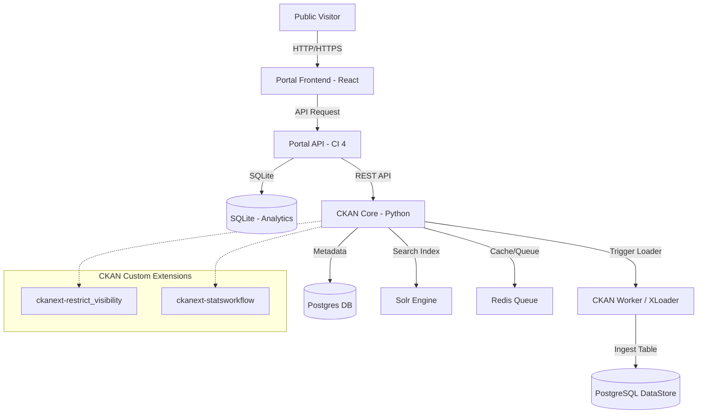

# Software Requirements Specification (SRS)
## Sistem Portal Data & Workflow Publikasi Statistik (CKAN)

---

## 1. Pendahuluan

### 1.1 Tujuan Dokumen
Dokumen Software Requirements Specification (SRS) ini ditujukan untuk memberikan gambaran teknis lengkap mengenai sistem arsitektur, kebutuhan fungsional dan non-fungsional, spesifikasi API, serta struktur data pada proyek integrasi **Portal Data Frontend** dan **DMS CKAN** dengan ekstensi kustom `ckanext-restrict_visibility` dan `ckanext-statsworkflow`.

### 1.2 Cakupan Sistem
Sistem ini terdiri dari tiga komponen utama yang saling berintegrasi melalui API:
1. **CKAN Core & Containers**: Platform penyimpanan dataset, database metadata (PostgreSQL), pencarian (Solr), antrean worker (Redis), dan pengunggah tabel (DataPusher/xloader).
2. **CKAN Custom Extensions**:
   - `ckanext-restrict_visibility`: Penegakan otorisasi visibilitas dataset dan parser file HTML table.
   - `ckanext-statsworkflow`: Logika mesin status (*state machine*) alur persetujuan publikasi data.
3. **Portal API (CodeIgniter 4)**: Backend proxy untuk menjembatani komunikasi aman antara frontend dengan CKAN serta mencatat kunjungan (*visitor counter*).
4. **Portal Frontend (React + Recharts + Tailwind/Vanilla CSS)**: Halaman publik interaktif untuk visualisasi data tabular, grafik tren tahunan, pencarian, dan pengunduhan file.

---

## 2. Arsitektur Sistem

Arsitektur sistem dibangun di atas teknologi kontainer (Docker Compose) dengan pembagian tanggung jawab sebagai berikut:



---

## 3. Kebutuhan Fungsional (Functional Requirements)

### 3.1 Modul Otorisasi & Visibilitas (ckanext-restrict_visibility)
* **FR-1.1 (Pembatasan Hak Cipta)**: Sistem harus menolak aksi `package_create` dan `package_update` yang diset `private = False` (Public) apabila pelaku aksi tidak memiliki wewenang `sysadmin` atau `organization_update` (Admin Organisasi).
* **FR-1.2 (Pencegahan Bypass Form)**: Logika visibilitas harus dipasang pada level *auth function* backend CKAN, bukan hanya di level UI form, sehingga bypass menggunakan HTTP Client (seperti Postman atau curl) tetap akan dipaksa menjadi `private = True`.
* **FR-1.3 (Konversi File HTML palsu)**: Ketika file `.xls` diunggah ke DataStore, sistem melalui xloader harus mendeteksi apakah isinya berupa kode tabel HTML (`<table`, `<tr>`, `<td>`). Jika terdeteksi:
  - Sistem harus mengekstrak isi tabel tersebut.
  - Sistem harus merapikan header kolom ganda (misalnya kolom `Tahun` dan list tahun di baris bawahnya) menjadi format baris header tunggal yang unik.
  - Sistem harus mengonversinya menjadi file `.csv` sementara agar proses ingest ke DataStore berhasil.

### 3.2 Modul Siklus Alur Data (ckanext-statsworkflow)
* **FR-2.1 (Mesin Status Alur)**: Sistem harus mendukung penyimpanan status kustom di dalam metadata *extras* dengan kunci `stats_workflow_status`. Daftar status yang didukung:
  1. `draft`: Awal pembuatan dataset oleh Editor.
  2. `waiting_validation`: Menunggu persetujuan dari Validator.
  3. `revision_from_validator`: Dataset dikembalikan ke Editor untuk direvisi.
  4. `waiting_verification`: Menunggu persetujuan dari Verifikator.
  5. `revision_from_verificator`: Dataset dikembalikan ke Editor untuk direvisi.
  6. `waiting_publish`: Menunggu rilis akhir dari Publikator.
  7. `published`: Dataset sukses rilis dan visibilitas otomatis berubah menjadi **Public**.
* **FR-2.2 (Pembatasan Tombol UI)**: Halaman detail dataset CKAN hanya boleh memunculkan tombol transisi alur yang sesuai dengan status dataset saat ini dan peran pengguna yang sedang masuk (*login*).
* **FR-2.3 (Validasi Jalur Transisi)**: Sistem harus menolak perubahan status yang tidak sesuai dengan alur transisi linier (misal: melompat dari `draft` langsung ke `published` tanpa validasi/verifikasi).

### 3.3 Modul Portal Publik (Portal Frontend & API)
* **FR-3.1 (Pratinjau DataStore)**: Portal Frontend harus menampilkan data tabular dari DataStore CKAN secara dinamis menggunakan *grid table* yang memiliki fitur pagination.
* **FR-3.2 (Visualisasi Grafik Garis)**: Portal Frontend harus mendeteksi kolom tahun secara dinamis (mendukung format penulisan angka tahun langsung seperti `2015` maupun dengan prefix seperti `Tahun 2015`). Data tahun tersebut harus divisualisasikan dalam bentuk **Line Chart (Recharts)** yang interaktif.
* **FR-3.3 (Pembersihan Baris Header Palsu)**: Sistem harus mendeteksi dan membuang baris data kosong atau baris duplikasi header yang terbawa dari file Excel asli agar tidak merusak visualisasi grafik.
* **FR-3.4 (Visitor Counter)**: Portal API harus mencatat jumlah kunjungan unik secara asinkron ke database SQLite lokal `/writable/analytics/visitors.sqlite3` dan menyediakan API untuk dibaca oleh frontend.

---

## 4. Spesifikasi Database & Metadata

### 4.1 Metadata Dataset CKAN (Extras)
Status alur data disimpan sebagai kolom metadata kustom pada data skema `package` CKAN:

| Meta Key | Data Type | Value | Deskripsi |
| --- | --- | --- | --- |
| `stats_workflow_status` | String | `draft` \| `waiting_validation` \| `revision_from_validator` \| `waiting_verification` \| `revision_from_verificator` \| `waiting_publish` \| `published` | Status siklus persetujuan dataset. |
| `private` | Boolean | `True` \| `False` | Keamanan dataset. Bernilai `True` pada semua status kecuali `published`. |

### 4.2 SQLite Database - Visitor Counter
Tabel `visitors` digunakan di sisi backend Portal API (PHP CodeIgniter) untuk menghitung statistik kunjungan:

```sql
CREATE TABLE IF NOT EXISTS visitors (
    id INTEGER PRIMARY KEY AUTOINCREMENT,
    ip_address TEXT NOT NULL,
    user_agent TEXT,
    visited_at DATETIME DEFAULT CURRENT_TIMESTAMP
);
```

---

## 5. Spesifikasi API (API Reference)

### 5.1 Endpoint API Kustom CKAN (RPC Style)
Seluruh API ini diakses dengan mengirimkan Header `Authorization: <CKAN_API_KEY>` dari user yang memiliki peran yang sesuai.

#### 1. Show Workflow Status
* **Endpoint**: `POST /api/3/action/statsworkflow_status_show`
* **Request Body**:
  ```json
  { "id": "cakupan-layanan-kesehatan-lansia" }
  ```
* **Response (Success)**:
  ```json
  {
    "success": true,
    "result": {
      "id": "003a71e0-098a-4d65-858e-a5ebfd5923cc",
      "name": "cakupan-layanan-kesehatan-lansia",
      "private": true,
      "status": "waiting_validation",
      "status_field": "stats_workflow_status"
    }
  }
  ```

#### 2. Submit ke Validator (Editor Action)
* **Endpoint**: `POST /api/3/action/statsworkflow_submit_validation`
* **Request Body**: `{ "id": "nama-dataset" }`

#### 3. Setujui Validasi (Validator Action)
* **Endpoint**: `POST /api/3/action/statsworkflow_validator_approve`
* **Request Body**: `{ "id": "nama-dataset" }`

#### 4. Tolak / Minta Revisi Validasi (Validator Action)
* **Endpoint**: `POST /api/3/action/statsworkflow_validator_revision`
* **Request Body**: `{ "id": "nama-dataset" }`

#### 5. Setujui Verifikasi (Verifikator Action)
* **Endpoint**: `POST /api/3/action/statsworkflow_verificator_approve`
* **Request Body**: `{ "id": "nama-dataset" }`

#### 6. Tolak / Minta Revisi Verifikasi (Verifikator Action)
* **Endpoint**: `POST /api/3/action/statsworkflow_verificator_revision`
* **Request Body**: `{ "id": "nama-dataset" }`

#### 7. Publish Akhir (Publikator Action)
* **Endpoint**: `POST /api/3/action/statsworkflow_publish`
* **Request Body**: `{ "id": "nama-dataset" }`

---

### 5.2 Endpoint Portal API (REST)
Backend Portal API bertindak sebagai proxy pintar yang mempercepat respon data dan menyediakan analytics kunjungan.

* **`GET /api/datasets`**: Mengambil daftar dataset publik teratas dari CKAN.
* **`GET /api/dataset/{slug}`**: Mengambil detail metadata dataset spesifik.
* **`GET /api/topics`**: Mengambil daftar Topik (Groups) CKAN beserta jumlah dataset di dalamnya.
* **`GET /api/group-datasets?group={slug}`**: Mengambil dataset yang terikat dengan topik tertentu.
* **`GET /api/preview/{resource_id}`**: Mengambil data pratinjau tabular dari CKAN DataStore (limit default 20 record).
* **`GET /api/visitors`**: Mengambil total jumlah kunjungan unik portal.
* **`POST /api/visitors/increment`**: Mencatat satu hit kunjungan baru secara aman.

---

## 6. Kebutuhan Non-Fungsional (Non-Functional Requirements)

* **NFR-1 (Security - Keamanan Akses)**: API Key CKAN milik sysadmin dan modul data harus disimpan secara aman menggunakan file konfigurasi `.env` dan tidak boleh bocor ke sisi frontend aplikasi React.
* **NFR-2 (Performance - Kecepatan Respon)**:
  - Proses konversi HTML ke CSV di sisi xloader harus berjalan kurang dari 3 detik untuk ukuran file di bawah 5 MB.
  - Portal Frontend harus menerapkan teknik *lazy loading* untuk komponen grafik Recharts demi menghemat memori browser.
* **NFR-3 (Reliability - Keandalan Antrean)**: Pengolahan data tabular yang berat harus dijalankan secara asinkron di latar belakang menggunakan antrean antarmuka **Redis** dan worker default CKAN, agar tidak memblokir respon HTTP server web utama.
* **NFR-4 (Compatibility - Kompatibilitas Browser)**: Portal Frontend wajib berjalan dengan mulus di semua browser modern berbasis engine Chromium (Google Chrome, Microsoft Edge, Opera), WebKit (Safari), dan Gecko (Mozilla Firefox).
